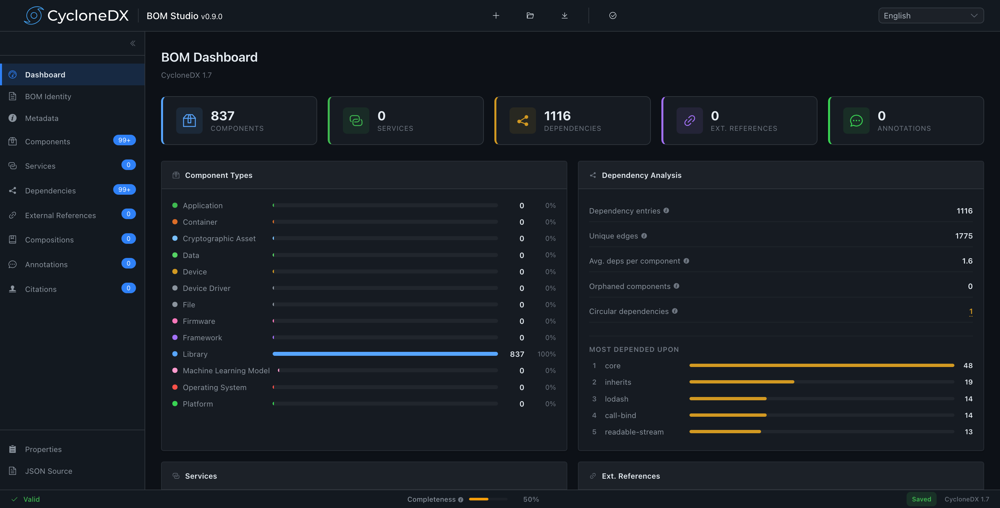

# CycloneDX BOM Studio

A visual editor for creating and managing [CycloneDX](https://cyclonedx.org/) Bills of Materials (BOMs). BOM Studio lets you build, edit, validate, and export CycloneDX BOMs through an intuitive browser-based interface — no command-line tools or manual JSON editing required.



## What is a BOM?

A Bill of Materials is a structured inventory of all components, libraries, and dependencies that make up a software or hardware product. BOMs are increasingly required for software supply chain security, regulatory compliance, and vulnerability management. CycloneDX is one of the leading open standards for SBOM representation.

## Features

**Create and Edit BOMs Visually**
Build CycloneDX BOMs from scratch or open existing ones for editing. Most fields in the CycloneDX specification are accessible through structured forms with contextual help and validation.

**CycloneDX 1.4 – 1.7 Support**
Full support for CycloneDX specification versions 1.4 through 1.7. BOMs using older formats (1.0 – 1.5) are automatically upgraded to 1.7 on import. Version-specific fields appear and hide based on the selected spec version.

**Component Management**
Add and edit components of all CycloneDX types: application, framework, library, container, platform, device, device-driver, firmware, file, machine-learning-model, data, cryptographic-asset. Each component type shows its relevant property editors.

**Dependency Visualization**
View and edit dependency relationships in three ways: a searchable table, a collapsible tree, and an interactive force-directed graph. Filter dependencies by component name and navigate between views.

**Real-Time Validation**
Validate your BOM against the official CycloneDX JSON schema at any time. Validation errors are shown inline with direct navigation to the relevant field.

**Import and Export**
Open BOM files in JSON format. Export your work as JSON. View and edit the raw JSON source directly in an integrated CodeMirror editor with syntax highlighting.

**Localization**
Available in 8 languages: English, French, German, Spanish, Chinese (Simplified), Arabic, Japanese, and Russian. RTL layout is supported for Arabic.

**Full BOM Editing Surface**
Edit all top-level BOM sections: metadata (including tools, authors, supplier, manufacturer, licenses), components, services, dependencies, vulnerabilities, compositions, external references, annotations, formulation, declarations, and definitions.

## Getting Started

### Prerequisites

- [Node.js](https://nodejs.org/) 20 or later
- npm 10 or later

### Install Dependencies

```bash
npm install
```

### Development Server

```bash
npm run dev
```

Opens a hot-reloading dev server at `http://localhost:5173`.

Alternatively, you can use a local Docker container to run the dev server.

```bash
./dev.sh
```

### Production Build

```bash
npm run build
```

Outputs optimized static files to `dist/`. The production build includes Content Security Policy meta tags.

### Preview Production Build

```bash
npm run preview
```

### Run Tests

```bash
npm run test              # single run
npm run test:watch        # watch mode
npm run test:coverage     # with coverage report
```

### Base URL Configuration

To deploy under a subpath, set the `BASE_URL` environment variable:

```bash
BASE_URL=/my-app/ npm run build
```

## Technology

| Category | Technology |
|----------|-----------|
| Framework | Vue 3 (Composition API, `<script setup>`) |
| Language | TypeScript 5.9 |
| Build | Vite 7 |
| UI Library | Element Plus |
| State | Pinia |
| Routing | Vue Router |
| Validation | AJV with ajv-formats |
| Code Editor | CodeMirror 6 |
| Graph | v-network-graph + d3-force |
| i18n | vue-i18n (lazy-loaded locales) |
| Styling | SCSS with BEM naming and design tokens |
| Testing | Vitest + Vue Test Utils + jsdom |

## Project Structure

```
src/
├── components/
│   ├── editors/          # Field-level editors (crypto, data, etc.)
│   ├── layout/           # App shell, header, sidebar
│   └── shared/           # Reusable form components
├── composables/          # Shared composition functions
├── i18n/                 # Internationalization and locale files
├── router/               # Route definitions
├── schemas/              # CycloneDX JSON schemas (1.4–1.7)
├── stores/               # Pinia stores (BOM, UI, validation)
├── styles/               # SCSS tokens, mixins, global styles
├── types/                # TypeScript type definitions
└── views/                # Page-level route components
```

## Supported CycloneDX Versions

| Spec Version | Support |
|-------------|---------|
| 1.2 – 1.5 | Auto-upgraded to 1.7 on import |
| 1.6 | Full support - JSON only |
| 1.7 | Full support - JSON only (default) |

## License

See [LICENSE](LICENSE) for details.
